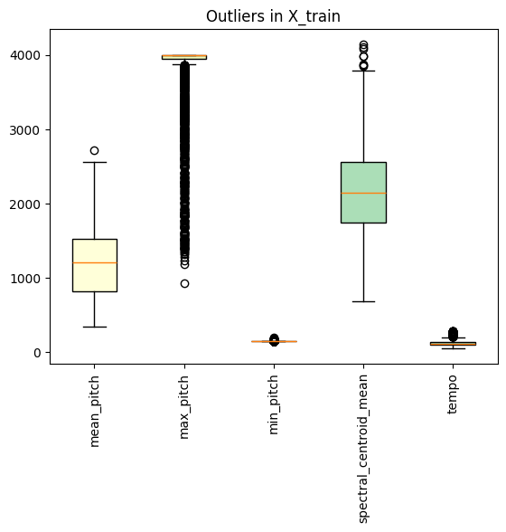
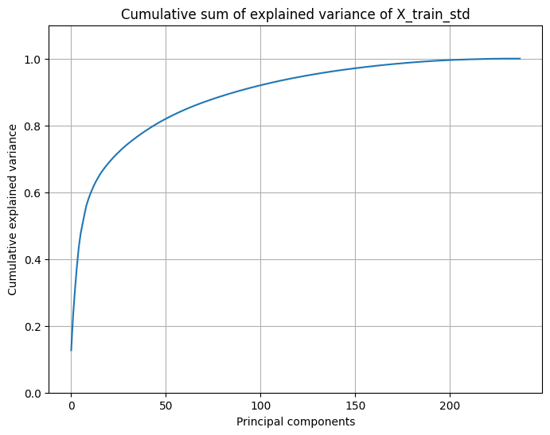
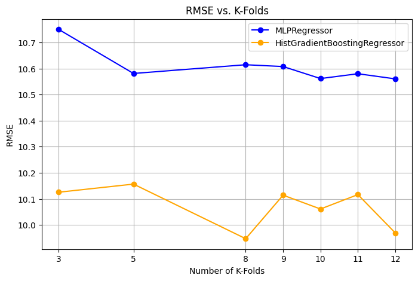
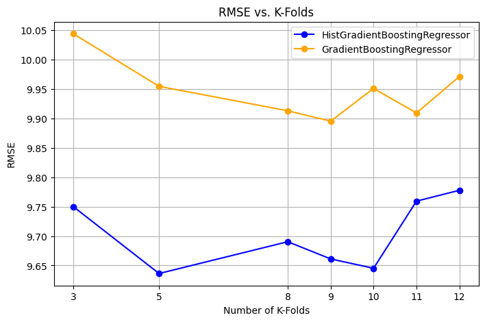
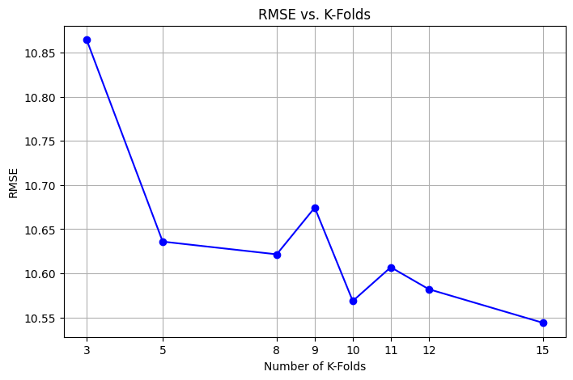

# DSL Winter Project 2025

This repository contains the work carried out for the **Data Science Lab – Winter Project 2025** at Politecnico di Torino.  
The goal of the project was to **build and evaluate machine learning models on an audio-based dataset**, focusing on model design, feature extraction, and performance evaluation for predicting a person's age based on their voice. Multiple audio features are extracted from each input file, and various machine learning models are trained to predict the age. The best-performing model is selected based on evaluation metrics.

---

## Project Description

The goal of this project is to predict the age of speakers based on their audio recordings.
The dataset includes metadata such as gender and nationality, while the acoustic features were extracted directly from the audio files using our own processing pipeline. 

We explored different **feature extraction techniques**, **normalization methods**, and **machine learning models**, with the aim of maximizing the performance on the evaluation dataset.

---

## Methodology

1. **Data Understanding & Preprocessing**
   - Loading `X_train.csv` and `development.csv`
   - Cleaning, normalization (standard scaling and min–max)
   - Exploratory analysis using `report_exam_winter_2025.ipynb`

2. **Feature Engineering**
   - Extraction of audio descriptors:
     - Mel-frequency cepstral coefficients (MFCCs),
     - Spectral centroid,
     - Zero-crossing rate
     - Chroma feature
   - Aggregation and selection of the most informative features

3. **Modeling**
   - Baseline models: Linear Regression, Ridge, Lasso, MLP Regressor, SVR, Random Forest Regressor, Decision Tree Regressor, RANSAC Regressor, Huber Regressor, Gradient Boosting Regressor, Hist Gradient Boosting Regressor
   - Comparison of different normalization techniques
   - Cross-validation and hyperparameter tuning

4. **Evaluation**
   - Performance assessed using metric **RMSE** 
   - Creation of the `final_submission_all.csv`, `final_submission_best.csv`, and `final_submission_std.csv` for submission

---

## Images

  
  

  <b>Figure 1:</b> Outliers w.r.t. some features in train dataset. &nbsp;&nbsp;
  <b>Figure 2:</b> PCA plot of train dataset normalized.

  
  

  <b>Figure 3:</b> RMSE of Hist G. Boosting vs MLP regressor &nbsp;&nbsp;
  <b>Figure 4:</b> RMSE of Hist G. Boosting vs G. Boosting

  

  <b>Figure 5:</b> RMSE w.r.t. K value of K-Fold

---

## Final result
   - Achieved an RMSE of 9.250 on the evaluation set, obtaining the best performance on the test set among all teams from the Data Science and Engineering class at Politecnico di Torino.
